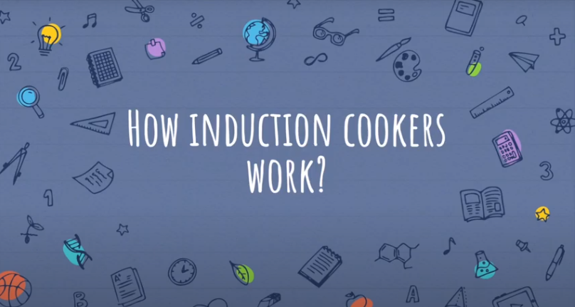

How can students collaborate to learn the same material? This is a course project spanning one month for the course *Tools for Online Learning* at CMU. We used the concept of jigsaw and collaborative learning to design and build a website for teaching how an induction cooker works. You can find the website [here](https://daniel-zhuwh.github.io/TOL2_induction_cooker/). You can also find the full [instructional video](https://www.youtube.com/watch?v=HJUrWq43uuo) here. (That's my voice :P)

I was involved in the design of its instructional content and was fully responsible for the implementation of the website.
 
Github: <a href="https://github.com/Daniel-ZhuWh/TOL2_induction_cooker"><i class="large github icon"></i>Daniel-ZhuWh/TOL2_induction_cooker</a>