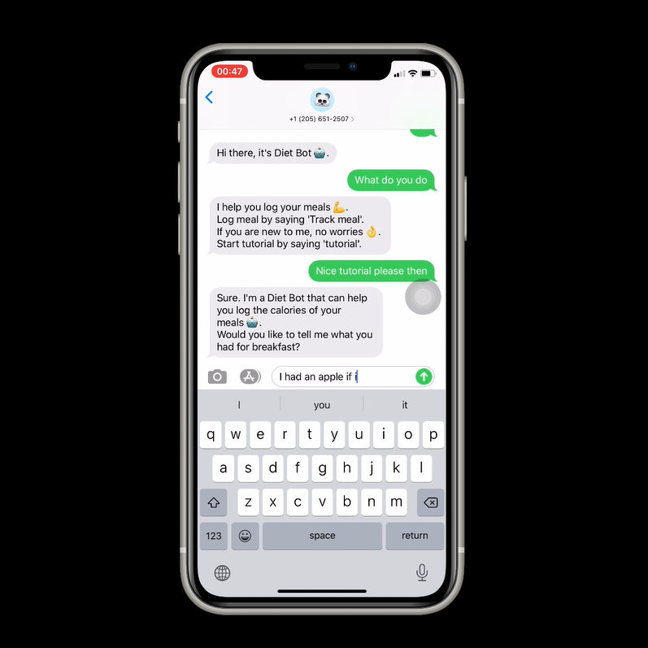
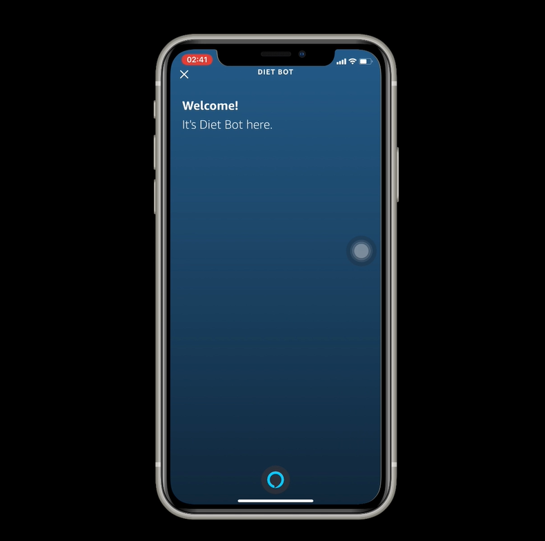
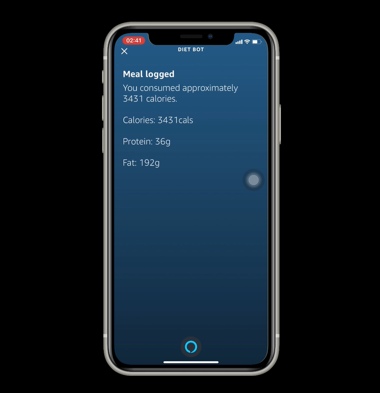

  
  
  

Diet bot is a conversational bot that I built for helping people keep track of their diet. It operates through SMS.

You can find the demo video I shot for it [here](https://www.youtube.com/watch?v=XjCgLHumhCI)

Github: <a href="https://github.com/Daniel-ZhuWh/Diet-bot"><i class="large github icon "></i>Daniel-ZhuWh/Diet-bot</a>

