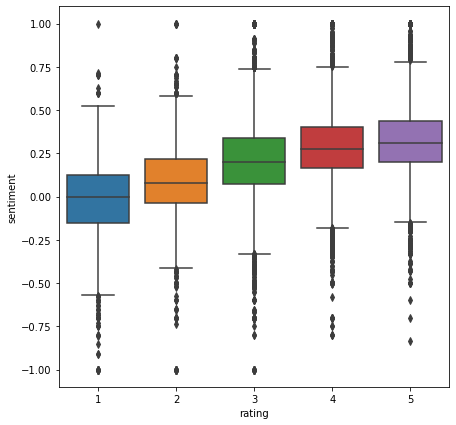

  
  
  

Have you ever thought about dropping out from high school? Have you ever worried about your scores in high shcool? No matter what your answer is, graduation from high school is a bare minimum for students’ later academic and socioeconomic success. Also, prior researches indicated that high school grades are a stronger incremental predictor of college outcomes—including what is arguably the most important outcome of all: graduation. (Galla, Brian M., et al., 2019)

However, in the United States, Low academic performance in high school and increasing drop-out rates become major educational issues. it is estimated that Nearly one-third of all public high school students in the U.S. fail to graduate in four years (Chapman et al., 2011; Stillwell and Sable, 2013).

We researched three main questions:
- What do parents/students usually focus on when they write reviews about high schools?
- How are public high schools in New York distributed based on different factors?
- What factors might influence the average graduation rate of public high schools in NY?

You can find the detailed analysis from [here](https://nbviewer.jupyter.org/github/Daniel-ZhuWh/Final_report_niche/blob/master/Final_analysis.ipynb).
