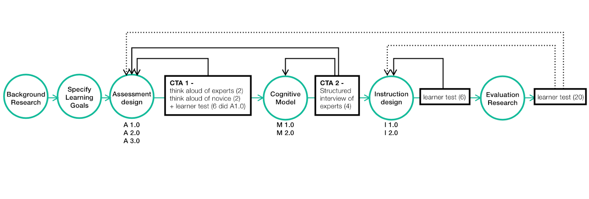

Off-by-one error doesn't have a complex rationale but could be a huge headache for beginning programmers. We designed and refined an OLI(Open Learning Initiative) module applying evidence-based E-learning principles and helping students get rid of the problem.

You can get a quick overview from our presentation [here](https://drive.google.com/file/d/1C4EGNlfMY4j8vVqfvxQuairKQfvdJGG3/view?usp=sharing).

Or have a closer look at our [report](https://drive.google.com/file/d/1xJ3LI9nr7dL231tZ3zcZPioZPGh_7o-P/view?usp=sharing)